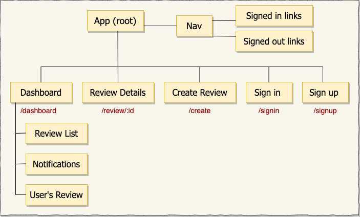
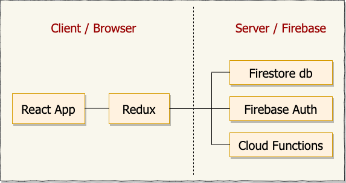
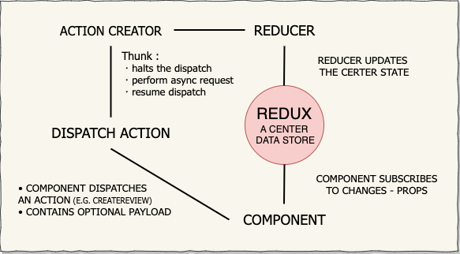

# Movie Review App

#### React with Firebase, 5.4.2020

#### By **_Jieun Kang_**
[](https://www.repostatus.org/#wip)


[](https://lbesson.mit-license.org/)


## 1. Description
A React application that have CRUD functionality of user's review with firestore, firebase authentication, and cloud functions.
  * Deployed to firebase hosting! https://react-movie-review.firebaseapp.com/
  * Credential for testing:
    - Email: test@test.com
    - Password: test1234

### ▫︎ Preview
<tabel>
  <tr>
    <td></td>
    <td></td>
    <td></td>
  </tr>
</table>  

### ▫︎ Implemented the following features:
* A user should be able to create, update and delete a review. All reviews should be stored in the database.
* A user should be able to fill out and submit reviews. Review results should be submitted to the database. (A review result can be associated to a review by mimicking a one-to-many relationship.)
* A user should be able to sign up, sign in, and sign out.
* A user should have their own dashboard which lists the reviews they've created.

### ▫︎ Component Diagram 
  
  
  

## 2. Development
### ▫︎ Technologies Used:
+ [ReactJs](https://reactjs.org/) 
+ [Redux 4.0.5](https://redux.js.org/)
+ [React Redux 7.1.3](https://react-redux.js.org/)
+ [npm](https://www.npmjs.com/) 
+ [Webpack](https://webpack.js.org/)
+ [Firebase](https://firebase.google.com/)
+ [Firestore](https://firebase.google.com/docs/firestore)
+ [Materialize](https://materializecss.com/)

### ▫︎ Run this project to development server
```bash
  $ git clone https://github.com/jieunkang-101/React-Review-App
  $ cd React-Review-App
  $ npm install  
  $ npm start
```
Now, it will automatically open http://localhost:3000 and show you review website.

## 3. Known Bugs
There are no known bug at this moment

## 4. Support and contact details
Any feedback is appreciated! Please contact at email: jieunkang101@gmail.com 

### License
*This software is licensed under the MIT license*
Copyright (c) 2020 **_Jieun Kang_**
